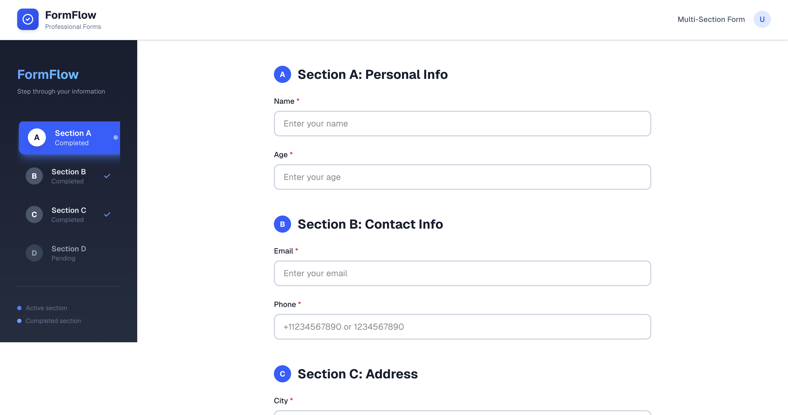
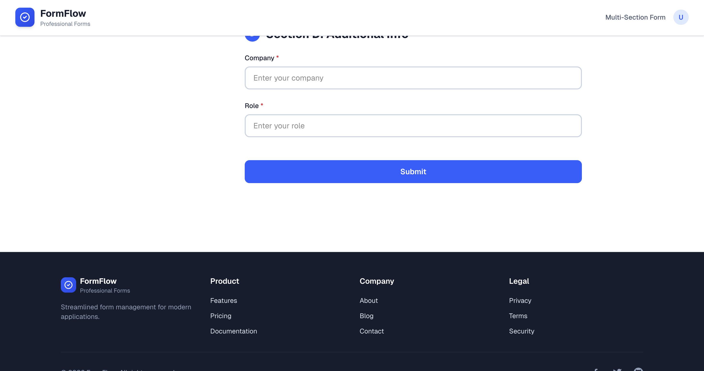
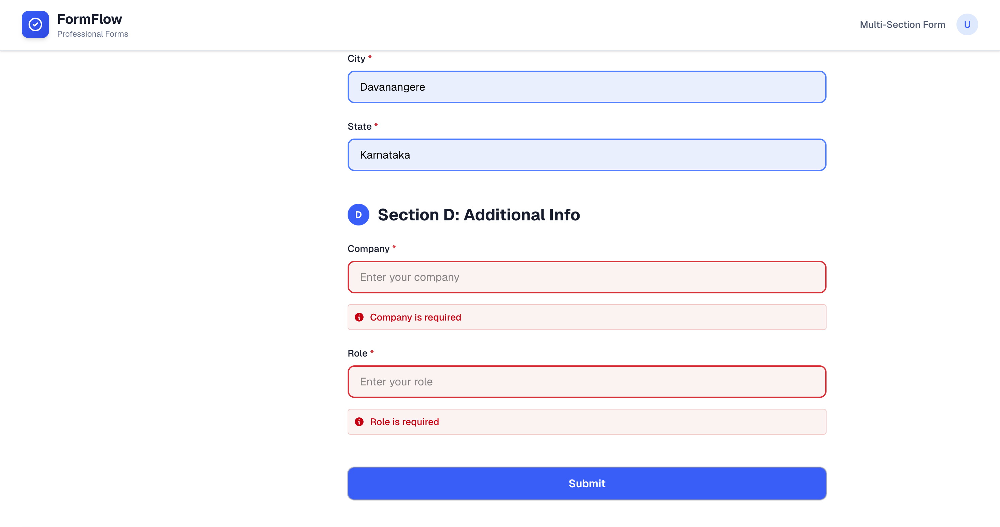
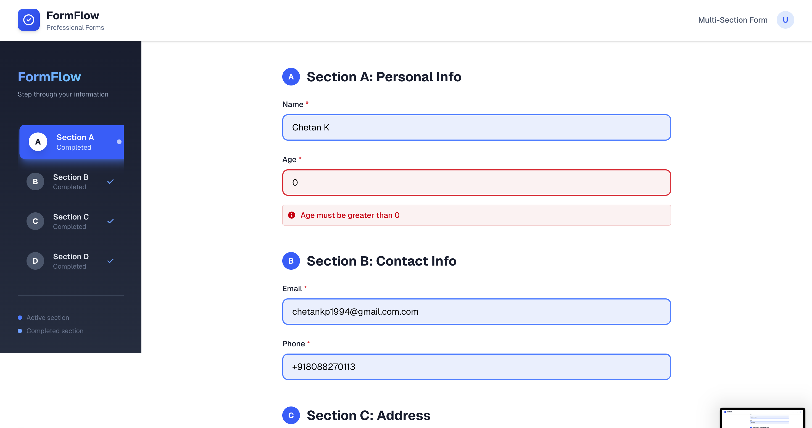
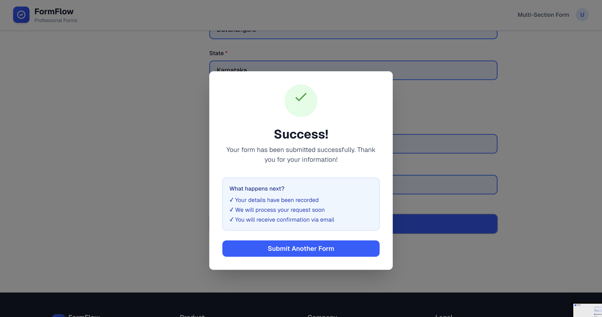
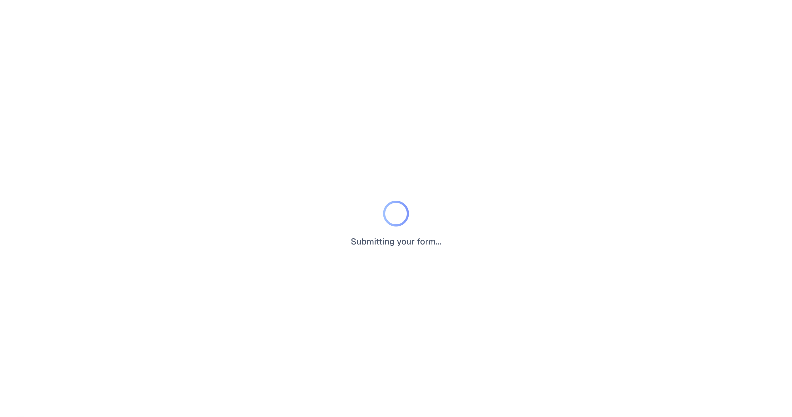

# Multi-Task Project Repository

This repository contains multiple task implementations. Each task is organized in its own directory with its own configuration and dependencies.

1. Project Structure

   app/
   page.tsx → Main page with Suspense
   layout.tsx → Layout & metadata
   globals.css → Global styles (Tailwind + theme config)

   components/form/
   footer.tsx → Footer section of the form page
   header.tsx → Header section of the form page
   formfield.tsx → Reusable FormField component with validation
   sidebar.tsx → Scroll-synced sidebar navigation with bullets
   successscreen.tsx → Success screen shown after form completion
   shimmerloader.tsx → Skeleton loader for simulated API call

   components/ui -> conatin all the ui components

   hooks/
   use-mobile.ts → Hook to detect mobile screen size
   use-toast.ts → Custom toast state management hook

   lib/
   utils.tsx → Utility functions (cn helper for class merging)

   public -> conatin all the images required for the application

   scripts/
   generate-model.mjs → Model generation guide
   create-custom-model.js → Setup instructions

## Task 1: Multi-Section Form Application

A React application featuring a multi-section form with advanced form handling capabilities.

### Quick Start

```bash
cd task-1
npm install
npm run dev
```

### Key Features

- 4-section form with 8 total fields
- Intersection Observer-based sidebar navigation with cumulative highlighting
- Formik-based form state management with Yup validation
- Smart error display (only after first submit, then live validation)
- Auto-triggering shimmer loader when all fields are valid
- Clean, modern UI with Tailwind CSS

### Form Sections

1. **Personal Information**: Name, Age
2. **Contact Information**: Email, Phone
3. **Address Information**: City, State
4. **Additional Information**: Company, Role

### Validation

- Required field validation
- Email format validation
- Phone number format (10 digits)
- Live validation after first submit attempt

### Technologies

- React 18
- Formik (Form management)
- Yup (Validation)
- Tailwind CSS (Styling)
- Vite (Build tool)
- TypeScript

### Screenshots ─╯

#### Form Section




#### Sidebar Navigation




#### Success Screen & Shimmer Loader



