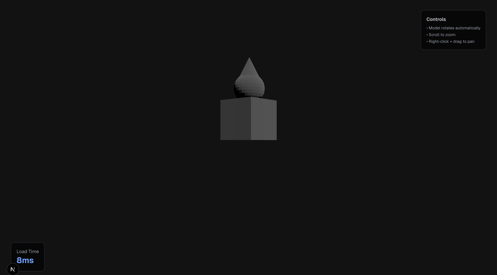
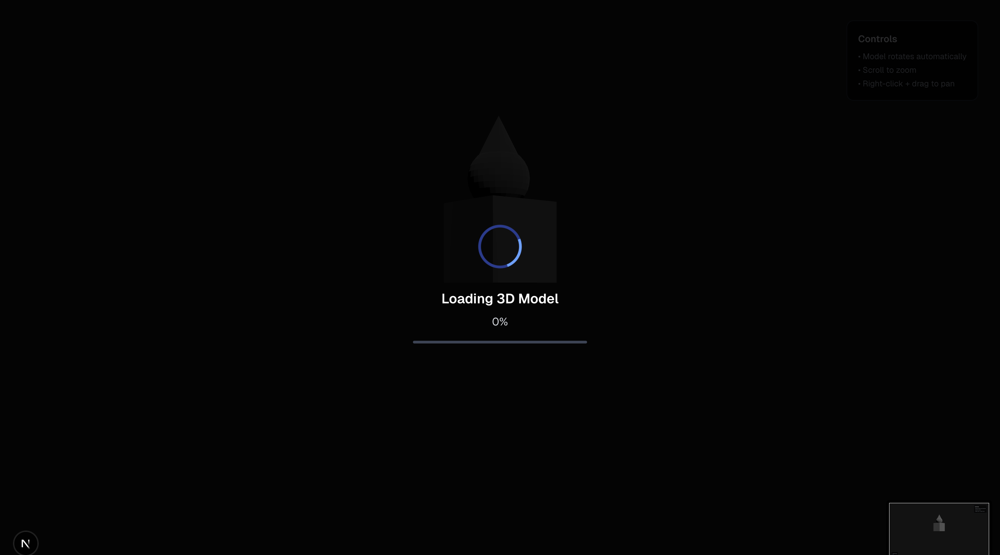

3D Model Viewer - Documentation Index

Welcome! This project implements a production-grade 3D Model Viewer using Three.js with optimized loading and memory management.

1. Add your model
   Place your .glb model file inside the /public/assets/3d/ directory of the project.

2. Use this command to compress your 3D model for better performance:
   command : gltf-pipeline -i duck.glb -o model-compressed.glb --draco.compressMeshes
   duck.glb is the original uncompressed model, while model-compressed.glb is the optimized version with Draco compression applied.
   File Size: <100KB (after compression)
   Compression: 70-95% reduction

3. Folder structure

   app/
   page.tsx → Main page with Suspense
   layout.tsx → Layout & metadata
   globals.css → Global styles (Tailwind + theme config)

   components/
   model-viewer.tsx → 3D viewer component
   theme-provider.tsx → Theme provider (Next Themes setup)

   hooks/
   use-mobile.ts → Hook to detect mobile screen size
   use-toast.ts → Custom toast state management hook

   lib/
   utils.tsx → Utility functions (cn helper for class merging)

   public/assets/3d/
   duck.glb → Sample (uncompressed) model
   model-compressed.glb → Sample compressed model
   (add your custom models here)

   scripts/
   generate-model.mjs → Model generation guide
   create-custom-model.js → Setup instructions

4. Main commands used to run your application,

npm install: Installs all required packages (like Three.js, Tailwind, Next.js, etc.)
npm run dev: Starts the app in development mode and Runs locally at: http://localhost:3000
npm run build: used to Create an optimized production build
npm start: used to Start the app using the production build and Used after running npm run build

5. .gitignore : which tells files and folders should not be tracked or uploaded to the repository

6. components.json: which tells how shadcn/ui components are generated and used in the project.

7. next.config.js: which tells file customizes behavior of our Next.js application.

8. package.json: This is the main configuration file for your project. It defines dependencies, scripts, and project metadata.

9. package-lock.json: his file is automatically generated when you run npm install.

10. postcss.config.mjs: This file configures PostCSS, which processes our CSS before it’s applied in the browser.

11. tsconfig.json: This file configures TypeScript behavior in our project.

12. This file is automatically generated by Next.js to provide TypeScript support for the framework.

13. External References
    Three.js Docs: https://threejs.org/docs/
    Draco Compression: https://github.com/google/draco
    glTF Format: https://www.khronos.org/gltf/

14. GitHub commands:
    git add .
    git commit -m "Add 3D model viewer"
    git push origin main

## Screenshots

### 3D Model Viewer

### Loading / Shimmer

